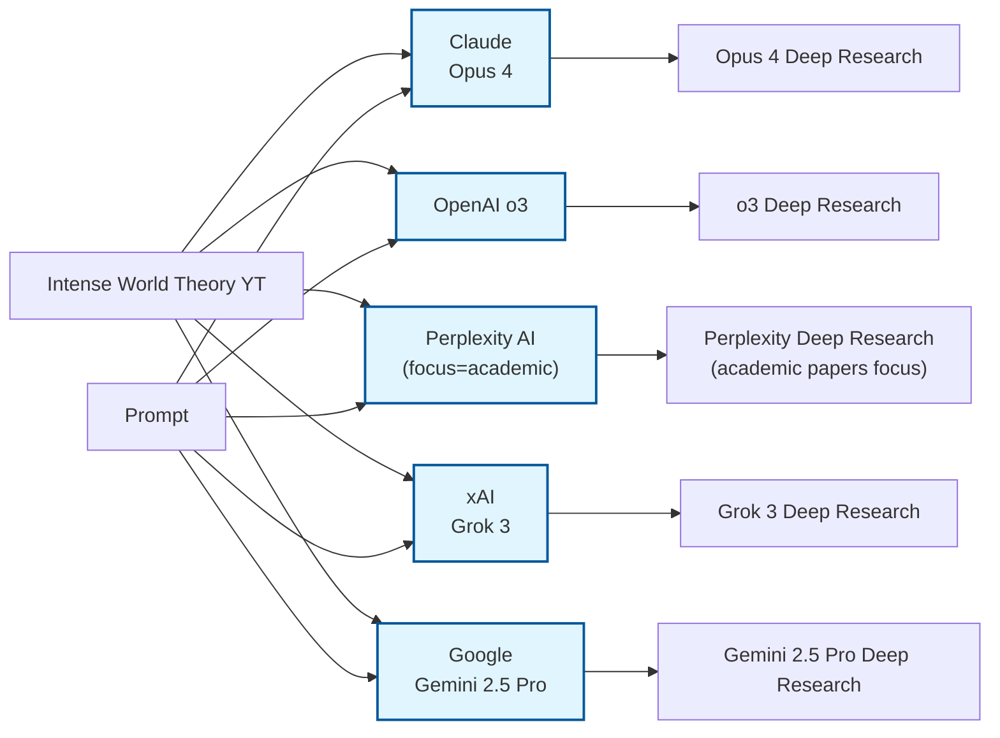

# Intense World & Amplified Minds Theory Collection

This repository contains a comprehensive collection of research, theories, and synthesis work on the Intense World Theory and the broader concept of "Amplified Minds" as a framework for understanding neurodiversity.

## Inspiration & Origin

This thought exercise was inspired by the video [**"What is the 'Intense World Theory'"**](https://youtu.be/x-17rFGkixQ?si=1Yvr3nsUaKi9ycf-) by [GenericArtDad](https://www.youtube.com/@GenericArtDad), which encourages brainstorming and conversation around neurodiversity. The video raises awareness about how many diagnostic criteria and understanding of neurodivergent experiences have only become possible recently, making these topics fresh, recent, and ripe for proper analysis, research, and collaborative work.

## Overview

The materials in this collection explore how neurodivergent minds (autism, ADHD, dyslexia, HSP, etc.) may operate not from deficit but from amplification - processing more information more intensely, with both advantages and challenges.

## Core Documents

### Original Sources & Inspiration
- [`genericartdad-youtube-intense-world-theory-transcript.md`](genericartdad-youtube-intense-world-theory-transcript.md) - YouTube transcript that sparked this research
- [`personal-theory-request-initial-notes-dyslexia-neurodiversity.md`](personal-theory-request-initial-notes-dyslexia-neurodiversity.md) - Personal experiences and initial theoretical framework

### Deep Research Results

**Model-Generated Analyses:**
* [Claude Opus 4: "Amplified Minds Boundary-Transcending Theory"](claude-opus-4-deep-research-amplified-minds-boundary-transcending-theory.md) ([prompt](claude-opus-4-deep-research-original-prompt.md), [metadata](claude-opus-4-deep-research-generation-metadata.md))
* [OpenAI o3: "Neurodiversity Amplified Minds Scientific Synthesis"](o3-deep-research-neurodiversity-amplified-minds-scientific-synthesis.md) ([prompt with agent Q&A](o3-deep-research-amplified-minds-theory-prompt-with-agent-questions.md))
* [Perplexity AI (focus=academic): "Intense World Theory Neuroscientific Framework"](perplexity-ai-deep-research-intense-world-theory-neuroscientific-framework.md)
* [Grok 3: "Amplified Minds Theory Analysis"](grok-3-deep-research-amplified-minds-theory-output.md)
* [Gemini 2.5 Pro: "Amplified Minds Theory Perspective"](gemini-2-5-pro-deep-research-amplified-minds-theory-output.md)

## Key Concepts

### The Amplified Mind Model
- **High Gain Input**: Lower sensory thresholds, reduced latent inhibition
- **Intensive Processing**: Parallel associations, hyperconnected networks
- **High Neural Plasticity**: Rapid learning and adaptation
- **Limited Bandwidth**: Mismatch between input and processing capacity
- **Signal-to-Noise Sensitivity**: Performance varies with input quality

### Cross-Cutting Themes
- Metabolic differences (5-15x energy consumption in dyslexia)
- Structural brain differences (white/grey matter ratios)
- Processing modalities (visual, kinesthetic, synesthetic)
- Adaptation patterns and environmental fit

## TODO Items

### Immediate Tasks
- [ ] Follow up on agent questions and user answers from o3 research
- [ ] Extract and synthesize key insights across all model outputs
- [ ] Create visual representations of the Amplified Minds model

### Cross-References Needed
- [ ] Link to `cognitive-kb/neuroscience-foundations-pub-kb/` for neurobiological evidence
- [ ] Link to `cognitive-kb/cognitive-science-pub-kb/memory-learning-pub-kb/` for plasticity aspects
- [ ] Link to `cognitive-kb/cognitive-computing-pub-kb/cognitive-models-pub-kb/` for computational analogies

### Future Development
- [ ] Compile evidence table distinguishing observations, theories, and hypotheses
- [ ] Create practical applications guide for education and therapy
- [ ] Develop assessment tools based on amplification model
- [ ] Connect with embodied cognition and predictive processing frameworks

## Related Topics

- Intense World Theory (Markram et al.)
- Sensory Processing Sensitivity (Aron)
- Enhanced Perceptual Functioning (Mottron)
- Monotropism (Murray)
- Neurodiversity paradigm
- Embodied cognition
- Predictive processing

## Contributing

This is an evolving collection. When adding new materials:
1. Use descriptive filenames in lowercase with hyphens
2. Include model name in prefix for AI-generated content
3. Link new documents in this README
4. Commit with descriptive messages

## Citation Note

This collection synthesizes personal experiences, academic research, and AI-assisted analysis. When referencing, please acknowledge the collaborative and interdisciplinary nature of this work.